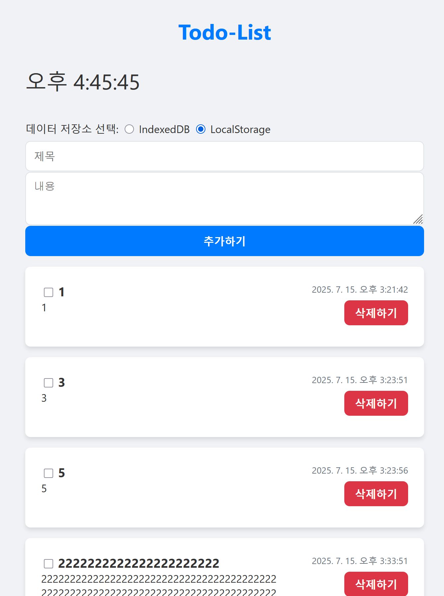
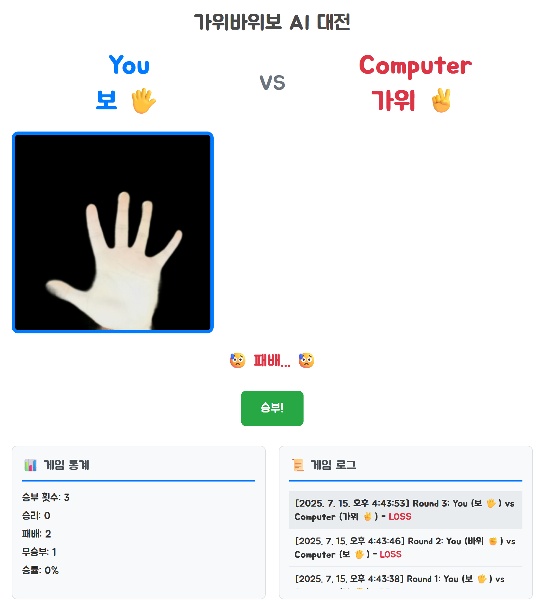

### 📂 GitHub에서 보기: [microsoft-ai-school/2025.07.15](https://github.com/J1STAR/microsoft-ai-school/tree/main/2025.07.15)

# 📅 2025년 7월 15일: JavaScript ES6+ 고급 문법 및 미니 프로젝트

## 📝 학습 목표

이번 학습에서는 최신 JavaScript(ES6+)의 강력한 문법인 구조 분해 할당, 펼치기 문법, 나머지 매개변수를 깊이 있게 이해하고, 이를 활용하여 실제 웹 애플리케이션에 적용하는 것을 목표로 합니다. 더 나아가, 유지보수성과 확장성이 뛰어난 애플리케이션을 구축하기 위한 아키텍처 설계 패턴(Controller, Service)을 학습하고, 이를 `Todo` 앱과 `가위바위보` 앱에 적용하여 실전 개발 역량을 강화합니다.

- **ES6+ 고급 문법 마스터**:
    - **구조 분해 할당(Destructuring Assignment)**: 배열과 객체의 데이터를 쉽고 간결하게 추출하여 변수에 할당하는 방법을 익힙니다. 중첩된 구조와 기본값 설정, 별칭(alias) 지정 등 고급 활용법을 숙달합니다.
    - **펼치기 문법(Spread Syntax)**: 배열이나 객체의 요소를 개별적인 값으로 확장하여 배열 리터럴, 함수 호출, 객체 병합 등 다양한 상황에서 효율적으로 활용하는 방법을 학습합니다.
    - **나머지 매개변수(Rest Parameters)**: 함수의 매개변수를 배열 형태로 받아 가변 인자 함수를 명확하고 간결하게 작성하는 방법을 익힙니다.

- **실전 SPA 아키텍처 설계 및 구현**:
    - **관심사 분리(Separation of Concerns)**: UI 상호작용과 비즈니스 로직을 각각 **Controller**와 **Service**로 분리하여 코드의 응집도를 높이고 결합도를 낮추는 아키텍처를 이해합니다.
    - **리포지토리 패턴(Repository Pattern)**: 데이터 소스(LocalStorage, IndexedDB 등)의 구체적인 구현을 추상화하여, 서비스 계층이 데이터 접근 기술에 종속되지 않도록 설계하는 방법을 학습합니다.
    - **외부 AI 모델 연동**: Teachable Machine으로 생성된 이미지 분류 모델을 웹 애플리케이션에 통합하고, 실시간 웹캠 입력을 처리하여 상호작용하는 방법을 익힙니다.

---

## 🖼️ 프로젝트 개요

본 프로젝트는 다음 세 가지 주요 파트로 구성됩니다.

1.  **JavaScript ES6+ 고급 문법 학습**:
    -   `구조 분해 할당`과 `펼치기/나머지 문법`은 최신 JavaScript 개발의 필수 요소입니다. 이들 문법의 기본 개념부터 실용적인 활용 사례까지, 인터랙티브한 예제가 포함된 `.html`과 `.js` 파일을 통해 체계적으로 학습합니다.

2.  **`Todo` 앱 개발**:
    -   단순한 형태의 `Todo` 앱을 데이터 저장 계층까지 고려한 **계층형 아키텍처(Controller-Service-Repository)**로 리팩토링하여 유연하고 확장 가능한 구조를 설계합니다.

3.  **`가위바위보` AI 대전 앱 개발**:
    -   웹캠을 통해 사용자의 손 모양을 실시간으로 인식하는 AI 대전 게임을 개발합니다. **Controller-Service** 아키텍처를 적용하고, Teachable Machine 모델을 연동하여 서비스 로직을 분리하는 방법을 학습합니다.

이 과정을 통해 최신 문법을 자유자재로 사용하는 능력과 함께, 유지보수와 테스트가 용이한 고품질의 웹 애플리케이션을 설계하고 구현하는 실전 역량을 함양하는 것을 목표로 합니다.

---

## 📁 파일 구성 및 설명

| 파일명                                                                                                                        | 설명                                                                                                                                                                                          | 공식 문서                                                                                                                                                                                          |
| :------------------------------------------------------------------------------------------------------------------------------ | :-------------------------------------------------------------------------------------------------------------------------------------------------------------------------------------------- | :------------------------------------------------------------------------------------------------------------------------------------------------------------------------------------------------- |
| [`javascript_destructuring.js`](./javascript_destructuring.js) / [`html`](./javascript_destructuring.html)                       | 배열과 객체의 값을 분해하여 변수에 간결하게 할당하는 구조 분해 할당의 다양한 사용법을 예제와 함께 학습합니다.                                                                                        | [MDN](https://developer.mozilla.org/ko/docs/Web/JavaScript/Reference/Operators/Destructuring_assignment)                                                                                         |
| [`javascript_spread_and_rest.js`](./javascript_spread_and_rest.js) / [`html`](./javascript_spread_and_rest.html)             | 배열/객체를 펼치는 펼치기 문법과 여러 인자를 배열로 모으는 나머지 매개변수의 차이점과 활용법을 학습합니다.                                                                                           | [MDN (Spread)](https://developer.mozilla.org/ko/docs/Web/JavaScript/Reference/Operators/Spread_syntax) / [MDN (Rest)](https://developer.mozilla.org/ko/docs/Web/JavaScript/Reference/Functions/rest_parameters) |
| **`todo-app/`**                                                                                                                 | **관심사가 분리된 계층형 아키텍처로 구현된 Todo 애플리케이션입니다.**                                                                                                                            | -                                                                                                                                                                                                  |
| ↳ [`index.html`](./todo-app/index.html)                                                                                       | Todo 앱의 전체적인 UI 구조를 정의하고, 데이터 저장소를 선택(LocalStorage/IndexedDB)할 수 있는 옵션을 제공합니다.                                                                                 | -                                                                                                                                                                                                  |
| ↳ [`src/domain/Todo.js`](./todo-app/src/domain/Todo.js)                                                                         | `Todo` 항목의 데이터 구조(id, content, status)를 정의하는 도메인 모델(VO, DTO)입니다.                                                                                                            | -                                                                                                                                                                                                  |
| ↳ [`src/controllers/todo.controller.js`](./todo-app/src/controllers/todo.controller.js)                                         | 사용자의 입력(할 일 추가, 삭제, 상태 변경, 저장소 선택 등)을 받아 `TodoService`에 처리를 요청하고, 그 결과를 받아 화면을 갱신하는 역할을 담당합니다.                                                    | -                                                                                                                                                                                                  |
| ↳ [`src/services/todo.service.js`](./todo-app/src/services/todo.service.js)                                                     | 할 일 추가, 수정, 삭제, 조회 등 애플리케이션의 핵심 비즈니스 로직을 수행합니다. `Repository`를 통해 데이터를 관리하며, `Controller`의 요청을 처리합니다.                                         | -                                                                                                                                                                                                  |
| ↳ [`src/repositories/todo.repository.interface.js`](./todo-app/src/repositories/todo.repository.interface.js)                   | 데이터 저장소가 반드시 구현해야 할 CRUD(Create, Read, Update, Delete) 메서드를 정의한 명세(Specification)입니다. 이를 통해 서비스 계층은 실제 데이터 저장 기술에 독립적일 수 있습니다.       | -                                                                                                                                                                                                  |
| ↳ [`src/repositories/todo.localstorage.repository.js`](./todo-app/src/repositories/todo.localstorage.repository.js)             | `TodoRepository` 인터페이스를 `LocalStorage` API를 사용하여 구현한 구체적인 저장소입니다.                                                                                                         | -                                                                                                                                                                                                  |
| ↳ [`src/repositories/todo.indexeddb.repository.js`](./todo-app/src/repositories/todo.indexeddb.repository.js)                   | `TodoRepository` 인터페이스를 `IndexedDB` API를 사용하여 구현한 구체적인 저장소입니다.                                                                                                            | -                                                                                                                                                                                                  |
| ↳ [`src/repositories/repository.factory.js`](./todo-app/src/repositories/repository.factory.js)                                 | 사용자의 선택에 따라 `LocalStorage` 또는 `IndexedDB` 리포지토리 인스턴스를 생성하여 반환하는 팩토리(Factory)입니다. 이를 통해 `Service`는 어떤 저장소가 사용되는지 알 필요가 없어집니다.        | -                                                                                                                                                                                                  |
| **`rock-paper-scissor-vs-app/`**                                                                                                | **Teachable Machine 모델을 연동하여 만든 AI 가위바위보 대전 앱입니다.**                                                                                                                         | -                                                                                                                                                                                                  |
| ↳ [`index.html`](./rock-paper-scissor-vs-app/index.html)                                                                        | 가위바위보 앱의 UI 구조를 정의합니다.                                                                                                                                                         | -                                                                                                                                                                                                  |
| ↳ [`data/models/rock-paper-scissor/`](./rock-paper-scissor-vs-app/data/models/rock-paper-scissor/)                              | [Teachable Machine](https://teachablemachine.withgoogle.com/)을 통해 학습된 '가위', '바위', '보' 손 모양 이미지 분류 모델 파일(`model.json`, `weights.bin`, `metadata.json`)이 저장되어 있습니다. | [Teachable Machine](https://teachablemachine.withgoogle.com/)                                                                                                                                      |
| ↳ [`src/controllers/game.controller.js`](./rock-paper-scissor-vs-app/src/controllers/game.controller.js)                        | UI 이벤트를 처리하고, 각 서비스를 조율하여 게임 로직을 실행합니다.                                                                                                                            | -                                                                                                                                                                                                  |
| ↳ [`src/services/game.service.js`](./rock-paper-scissor-vs-app/src/services/game.service.js)                                    | 컴퓨터의 선택, 승패 판정, 통계 및 로그 기록 등 순수 게임 로직을 담당합니다.                                                                                                                   | -                                                                                                                                                                                                  |
| ↳ [`src/services/hand-detection.service.js`](./rock-paper-scissor-vs-app/src/services/hand-detection.service.js)              | Teachable Machine 모델을 로드하고 웹캠 입력을 받아 사용자의 손 모양을 감지하는 로직을 담당합니다.                                                                                                   | -                                                                                                                                                                                                  |
| `README.md`                                                                                                                     | 본 학습 내용에 대한 정리 문서입니다.                                                                                                                                                              | -                                                                                                                                                                                                  |

---

## 🚀 주요 학습 내용 및 결과

### 1. JavaScript ES6+ 고급 문법: 코드의 간결성과 가독성 혁신

이번 학습의 첫 번째 파트에서는 최신 JavaScript의 개발 패러다임을 바꾼 두 가지 핵심 문법, **구조 분해 할당**과 **펼치기/나머지 문법**을 집중적으로 다루었습니다. 인터랙티브 예제를 통해 각 문법의 개념을 명확히 이해하고, 실무에서 마주할 수 있는 다양한 활용 시나리오를 학습했습니다.

-   **구조 분해 할당 (Destructuring Assignment)**:
    -   **핵심 개념**: 배열이나 객체의 속성을 쉽게 추출하여 개별 변수에 할당하는 문법입니다. 코드를 간결하게 만들고, 데이터의 특정 부분에 대한 접근성을 높여줍니다.
    -   **주요 학습 내용**:
        -   **기본 문법**: 배열은 인덱스 기반, 객체는 키 기반으로 값을 추출합니다.
        -   **기본값 할당**: 값이 `undefined`일 경우를 대비하여 기본값을 설정할 수 있어 코드의 안정성을 높입니다.
        -   **변수 이름 변경**: 객체 속성을 다른 이름의 변수에 할당하여 충돌을 피하거나 의도를 명확히 할 수 있습니다.
        -   **중첩 구조 분해**: 복잡한 중첩 객체나 배열의 깊은 곳에 있는 값도 한 줄의 코드로 쉽게 추출할 수 있습니다.
        -   **함수 매개변수 활용**: 함수에 객체를 전달할 때, 필요한 속성만 매개변수로 직접 받아 사용하여 코드 가독성을 크게 향상시킵니다.

-   **펼치기 문법 (Spread Syntax) & 나머지 매개변수 (Rest Parameters)**:
    -   **핵심 개념**: 두 문법 모두 `...`를 사용하지만, 사용되는 위치에 따라 기능이 다릅니다. 펼치기 문법은 배열이나 객체를 '펼쳐서' 개별 요소로 만드는 반면, 나머지 매개변수는 여러 개의 인자를 하나의 배열로 '모읍니다'.
    -   **주요 학습 내용**:
        -   **배열과 객체의 복사**: 원본을 변경하지 않는 불변성을 유지하며 안전하게 배열이나 객체를 복사할 수 있습니다. (Shallow Copy)
        -   **배열/객체 병합**: 여러 개의 배열이나 객체를 간결하게 하나로 합칠 수 있습니다.
        -   **함수 인자 전달**: 배열의 요소들을 함수의 개별 인자로 쉽게 전달할 수 있습니다.
        -   **가변 인자 함수 구현**: `arguments` 객체를 대체하여, 명시적으로 남은 모든 인자를 실제 배열로 받아 처리할 수 있어 더 직관적이고 유연한 함수를 만들 수 있습니다.

이러한 문법들을 통해 단순히 코드를 짧게 만드는 것을 넘어, **데이터의 불변성을 지키고 코드의 의도를 명확히 드러내는 현대적인 JavaScript 코딩 스타일**의 기반을 다졌습니다.

### 2. Todo App: 계층형 아키텍처와 유연한 데이터 관리

`todo-app` 프로젝트는 단순한 할 일 목록 앱을 넘어, **지속 가능하고 확장 가능한 웹 애플리케이션을 위한 아키텍처 설계**에 중점을 둡니다. 이 프로젝트를 통해 다음과 같은 핵심 소프트웨어 공학 원칙을 실제로 구현하고 체득했습니다.

-   **계층형 아키텍처 (Layered Architecture)**:
    -   **Controller**: UI의 이벤트 처리와 사용자 입력 검증을 담당하며, 화면에 데이터를 표시하는 역할만 수행합니다.
    -   **Service**: 애플리케이션의 핵심 비즈니스 로직(예: 할 일 추가, 삭제 규칙)을 담당합니다. 컨트롤러와 리포지토리 사이의 중재자 역할을 합니다.
    -   **Repository**: 데이터의 영속성(저장, 조회, 수정, 삭제)만을 책임집니다. 데이터가 `LocalStorage`에 저장되든, `IndexedDB`에 저장되든, 이 계층에서만 그 사실을 알고 있습니다.
    -   이러한 관심사 분리(SoC)는 각 계층이 독립적으로 수정 및 테스트될 수 있게 하여 **유지보수성을 극대화**합니다.

-   **리포지토리 패턴과 팩토리 패턴**:
    -   `TodoRepository`라는 **인터페이스**를 정의하여, 서비스 계층이 특정 데이터 저장 기술에 의존하지 않도록 만들었습니다.
    -   `localStorageRepository`와 `indexedDbRepository`는 이 인터페이스의 구체적인 **구현체**입니다.
    -   **팩토리(Factory)**는 사용자의 선택에 따라 적절한 구현체를 동적으로 생성하고 서비스 계층에 **주입(Inject)**해줍니다.
    -   이 구조 덕분에, 나중에 원격 서버 API와 통신하는 `NetworkRepository`를 추가하더라도 서비스나 컨트롤러 코드는 단 한 줄도 수정할 필요 없이 **확장**이 가능합니다.

이 프로젝트는 "어떻게 하면 변경에 유연하고, 테스트하기 쉬우며, 협업하기 좋은 코드를 작성할 수 있는가?"라는 질문에 대한 실질적인 답을 제시합니다.

### 3. 가위바위보 App: AI 모델 연동과 서비스 모듈화

`rock-paper-scissor-vs-app`은 외부 서비스(여기서는 Teachable Machine AI 모델)를 웹 애플리케이션에 통합하고, 이를 깔끔하게 관리하는 방법을 보여주는 실습 프로젝트입니다.

-   **Teachable Machine 기반 AI 모델 학습**:
    -   코딩 없이 웹 브라우저에서 직접 머신러닝 모델을 만들 수 있는 Google의 [Teachable Machine](https://teachablemachine.withgoogle.com/) 도구를 활용했습니다.
    -   '가위', '바위', '보' 세 가지 클래스(레이블)에 대해 웹캠으로 직접 촬영한 손 모양 이미지를 수백 장씩 학습시켰습니다.
    -   학습이 완료된 모델은 `TensorFlow.js` 라이브러리와 호환되는 `model.json`, `weights.bin`, `metadata.json` 파일로 추출하여 프로젝트에 포함시켰습니다. 이 과정을 통해 전문적인 머신러닝 지식 없이도 아이디어를 빠르게 프로토타이핑하고 실제 서비스에 통합하는 경험을 할 수 있었습니다.

-   **서비스 모듈화**:
    -   **`HandDetectionService`**: 웹캠을 제어하고, TensorFlow.js와 Teachable Machine 모델을 로드하며, 사용자의 손 모양을 판별하는 모든 복잡한 로직을 **캡슐화**했습니다. 이 서비스는 "3초 동안 손을 감지해서 가장 많이 나온 결과를 알려줘"라는 단순한 요청에 응답할 뿐, 게임의 규칙은 전혀 알지 못합니다.
    -   **`GameService`**: 컴퓨터의 패를 결정하고, 승패를 판정하며, 전적을 기록하는 등 순수한 게임 규칙만을 담당합니다. 이 서비스는 사용자의 손 모양이 웹캠으로 인식되었는지, 아니면 버튼으로 입력되었는지 전혀 신경 쓰지 않습니다.

-   **컨트롤러의 역할**:
    -   `GameController`는 이 두 서비스를 **조율하는 오케스트라의 지휘자**와 같습니다. 사용자가 '승부!' 버튼을 누르면, 컨트롤러는 먼저 `HandDetectionService`에 손 모양 감지를 요청하고, 그 결과를 받아 `GameService`에 승패 판정을 요청합니다. 마지막으로, `GameService`로부터 받은 최종 결과를 화면에 예쁘게 그려주는 역할을 수행합니다.

이러한 모듈화 방식은 각 서비스의 **독립성과 재사용성**을 크게 높입니다. 예를 들어, `GameService`는 웹캠 앱이 아닌, 일반 버튼 클릭 방식의 가위바위보 게임에도 그대로 재사용할 수 있습니다.

---

## 💡 학습 정리

이번 세션을 통해 ES6+의 핵심 문법을 실무적인 관점에서 깊이 있게 이해하고, 이를 바탕으로 견고하고 확장 가능한 웹 애플리케이션 아키텍처를 설계하는 능력을 배양했습니다.

-   **코드의 간결성과 가독성 향상**: 구조 분해 할당과 펼치기/나머지 문법을 사용하여 더 적은 양의 코드로 더 많은 작업을 수행하고, 코드의 의도를 명확하게 표현하는 방법을 터득했습니다.
-   **관심사 분리의 중요성 체감**: UI, 비즈니스 로직, 데이터 접근, 외부 서비스 연동 등 각기 다른 관심사를 독립된 계층과 모듈로 분리함으로써 얻는 이점을 명확히 이해했습니다. 이는 코드의 재사용성을 높이고, 단위 테스트를 용이하게 하며, 팀원 간의 협업을 원활하게 만듭니다.
-   **유연하고 확장 가능한 설계**: 리포지토리 패턴과 팩토리 패턴을 적용하여 데이터 저장 기술을 언제든지 쉽게 교체할 수 있는 유연한 구조를 만드는 방법을 학습했습니다. 이는 애플리케이션의 기술적 요구사항이 변경되더라도 최소한의 수정으로 대응할 수 있게 해주는 강력한 설계 기법입니다.

결론적으로, 단순히 기능을 구현하는 것을 넘어, **'어떻게 하면 더 좋은 코드를 작성하고, 더 나은 시스템을 설계할 것인가'**에 대한 해답을 아키텍처 패턴에서 찾을 수 있었습니다. 이는 향후 더 복잡하고 큰 규모의 프로젝트를 수행하는 데 튼튼한 기반이 될 것입니다. 